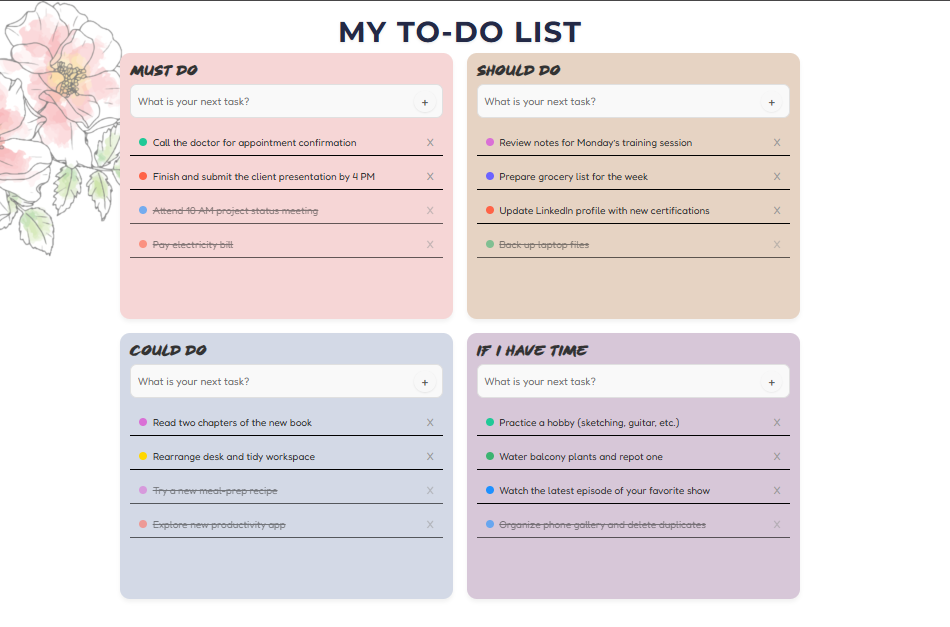

# 📝 Multi-Section To-Do List

A cute, multi-section to-do list web app with a modern, playful design. Organize your tasks by priority and enjoy a smooth, interactive experience!

## Screenshots

> 

## Features

- **Multiple Sections:**  
  Four categories: **Must Do**, **Should Do**, **Could Do**, and **If I Have Time**. Each section has its own input and task list.

- **Add Tasks:**  
  Type a task and press Enter or click the `+` button.  
  New tasks appear at the **top** of their section.

- **Mark as Completed:**  
  Click a task to mark it as completed.  
  Completed tasks move to the **bottom** of the list and appear faded with a strikethrough.

- **Unmark Completed:**  
  Click a completed task again to mark it as incomplete.  
  It moves back to the **top** of the list.

- **Delete Tasks:**  
  Click the `X` icon to remove a task with a smooth fade-out.

- **Input Validation:**  
  Prevents adding empty tasks and shows a warning message.

- **Section-Scoped Input:**  
  Tasks are added only to the section where you type.

## How It Works

- **Task Management:**  
  - Each section is independent.
  - Tasks are added at the top, completed tasks move to the bottom.
  - Deleting and toggling completion is instant and animated.

- **Visual Feedback:**  
  - Hovering over tasks and buttons gives visual cues.
  - Completed tasks are faded and struck-through.

## Getting Started

1. Clone the repository.
2. Open `index.html` in your browser.
3. Start organizing your tasks!

## Technologies Used

- HTML5
- CSS3 (with Google Fonts)
- JavaScript (ES6)
- jQuery

---

*Enjoy organizing your day! With this to-do list, you'll never forget a task again. Happy planning! 🎉*
